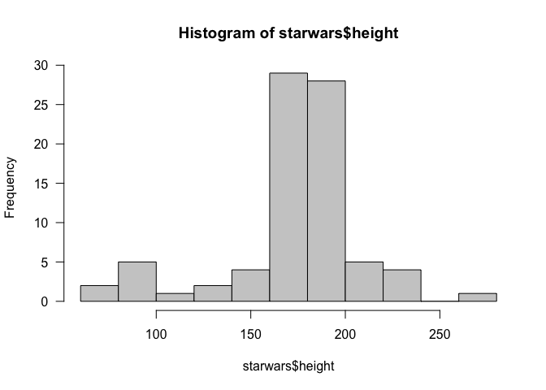
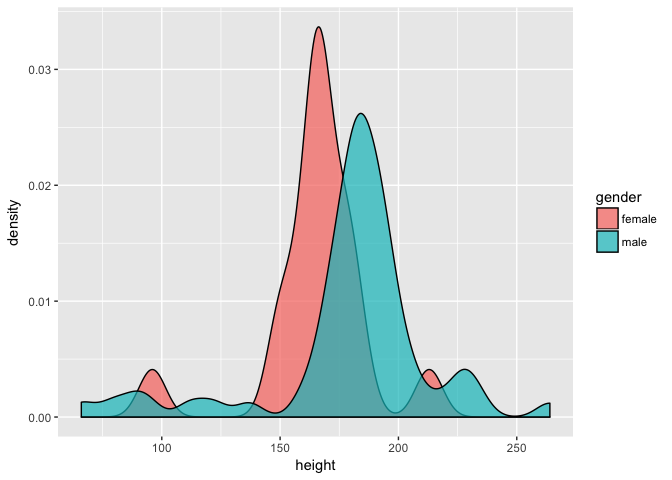
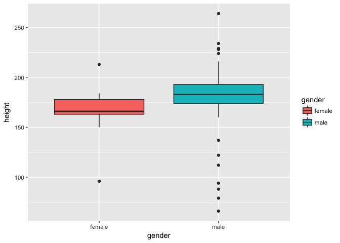
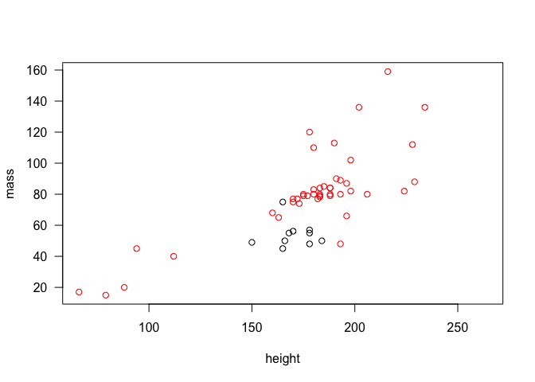

Pipes with dplyr
================
Gaston Sanchez

> ### Learning Objectives:
> 
>   - Compare base R and `"dplyr"`
>   - Get to know the pipe operator `%>%`

-----

## Introduction

Last week you started to manipulate data tables (e.g. `data.frame`,
`tibble`) with functions provided by the R package `"dplyr"`.

Having been exposed to the *dplyr* paradigm, let’s compare R base
manipulation against the various dplyr syntax flavors.

### Starwars Data Set

In this tutorial we are going to use the data set `starwars` that comes
in `"dplyr"`:

``` r
# load dplyr
library(dplyr)

# data set
starwars
```

    ## # A tibble: 87 x 13
    ##    name  height  mass hair_color skin_color eye_color birth_year gender
    ##    <chr>  <int> <dbl> <chr>      <chr>      <chr>          <dbl> <chr> 
    ##  1 Luke…    172    77 blond      fair       blue            19   male  
    ##  2 C-3PO    167    75 <NA>       gold       yellow         112   <NA>  
    ##  3 R2-D2     96    32 <NA>       white, bl… red             33   <NA>  
    ##  4 Dart…    202   136 none       white      yellow          41.9 male  
    ##  5 Leia…    150    49 brown      light      brown           19   female
    ##  6 Owen…    178   120 brown, gr… light      blue            52   male  
    ##  7 Beru…    165    75 brown      light      blue            47   female
    ##  8 R5-D4     97    32 <NA>       white, red red             NA   <NA>  
    ##  9 Bigg…    183    84 black      light      brown           24   male  
    ## 10 Obi-…    182    77 auburn, w… fair       blue-gray       57   male  
    ## # … with 77 more rows, and 5 more variables: homeworld <chr>,
    ## #   species <chr>, films <list>, vehicles <list>, starships <list>

### Average Height of Male and Female Individuals

For illustration purposes, let’s consider a relatively simple example.
Say we are interested in calculating the average (mean) height for both
female and male individuals. Let’s discuss how to find the solution
under the base R approach, as well as the dplyr approach.

-----

## Quick inspection of `height`

``` r
# summary stats of height
summary(starwars$height)
```

    ##    Min. 1st Qu.  Median    Mean 3rd Qu.    Max.    NA's 
    ##    66.0   167.0   180.0   174.4   191.0   264.0       6

``` r
# histogram
hist(starwars$height, col = 'gray80', las = 1)
```

<!-- -->

### Quick inspection of `gender`

``` r
# frequencies of gender
summary(starwars$gender)
```

    ##    Length     Class      Mode 
    ##        87 character character

``` r
gender_freqs <- table(starwars$gender)
gender_freqs
```

    ## 
    ##        female hermaphrodite          male          none 
    ##            19             1            62             2

``` r
# barchart of gender freqs
barplot(gender_freqs, border = NA, las = 1)
```

<!-- -->

Now let’s use `"dplyr"` to get the frequencies:

``` r
# distinct values 
distinct(starwars, gender)
```

    ## # A tibble: 5 x 1
    ##   gender       
    ##   <chr>        
    ## 1 male         
    ## 2 <NA>         
    ## 3 female       
    ## 4 hermaphrodite
    ## 5 none

Oh\! Notice that we have some missing values, which were not reported by
`table()`.

``` r
# frequencies of gender (via dplyr) 
count(starwars, gender)
```

    ## # A tibble: 5 x 2
    ##   gender            n
    ##   <chr>         <int>
    ## 1 <NA>              3
    ## 2 female           19
    ## 3 hermaphrodite     1
    ## 4 male             62
    ## 5 none              2

-----

## Base R approach

Let’s see how to use base R operations to find the average `height` of
individuals with `gender` female and male.

``` r
# identify female and male individuals
# (comparison operations)
which_females <- starwars$gender == 'female'
which_males <- starwars$gender == 'male'
```

``` r
# select the height values of females and males
# (via logical subsetting)
height_females <- starwars$height[which_females]
height_males <- starwars$height[which_males]
```

``` r
# calculate averages (removing missing values)
avg_ht_female <- mean(height_females, na.rm = TRUE)
avg_ht_male <- mean(height_males, na.rm = TRUE)

# optional: display averages in a vector
c('female' = avg_ht_female, 'male' = avg_ht_male)
```

    ##   female     male 
    ## 165.4706 179.2373

All the previous code can be written with more compact expressions:

``` r
# all calculations in a couple of lines of code
c("female" = mean(starwars$height[starwars$gender == 'female'], na.rm = TRUE),
  "male" = mean(starwars$height[starwars$gender == 'male'], na.rm = TRUE)
)
```

    ##   female     male 
    ## 165.4706 179.2373

-----

## With `"dplyr"`

The behavior of `"dplyr"` is functional in the sense that function calls
don’t have side-effects. You must always save their results in order to
keep them in an object (in memory). This doesn’t lead to particularly
elegant code, especially if you want to do many operations at once.

### Option 1) Step-by-step

You either have to do it step-by-step:

``` r
# manipulation step-by-step
gender_height <- select(starwars, gender, height)

fem_male_height <- filter(gender_height, 
                          gender == 'female' | gender == 'male')

height_by_gender <- group_by(fem_male_height, gender)

summarise(height_by_gender, mean(height, na.rm = TRUE))
```

    ## # A tibble: 2 x 2
    ##   gender `mean(height, na.rm = TRUE)`
    ##   <chr>                         <dbl>
    ## 1 female                         165.
    ## 2 male                           179.

### Option 2) Nested (embedded) code

Or if you don’t want to name the intermediate results, you need to wrap
the function calls inside each other:

``` r
summarise(
  group_by(
    filter(select(starwars, gender, height),
           gender == 'female' | gender  == 'male'),
    gender),
  mean(height, na.rm = TRUE)
)
```

    ## # A tibble: 2 x 2
    ##   gender `mean(height, na.rm = TRUE)`
    ##   <chr>                         <dbl>
    ## 1 female                         165.
    ## 2 male                           179.

This is difficult to read because the order of the operations is from
inside to out. Thus, the arguments are a long way away from the
function.

### Option 3) Piping

To get around the problem of nesting functions, `"dplyr"` also provides
the `%>%` operator from the R package `"magrittr"`.

What does the *piper* `%>%` do? Here’s a conceptual example:

``` r
x %>% f(y)
```

`x %>% f(y)` turns into `f(x, y)` so you can use it to rewrite multiple
operations that you can read left-to-right, top-to-bottom.

Here’s how to use the piper to calculate the average height for female
and male individuals:

``` r
avg_height_by_gender <- starwars %>% 
  select(gender, height) %>%
  filter(gender == 'female' | gender == 'male') %>%
  group_by(gender) %>%
  summarise(avg = mean(height, na.rm = TRUE))

avg_height_by_gender
```

    ## # A tibble: 2 x 2
    ##   gender   avg
    ##   <chr>  <dbl>
    ## 1 female  165.
    ## 2 male    179.

``` r
avg_height_by_gender$avg
```

    ## [1] 165.4706 179.2373

-----

## Another Example

Here’s another example in which we calculate the mean `height` and mean
`mass` of `species` Droid, Ewok, and Human; arranging the rows of the
tibble by mean height, in descending order:

``` r
starwars %>%
  select(species, height, mass) %>%
  filter(species %in% c('Droid', 'Ewok', 'Human')) %>%
  group_by(species) %>%
  summarise(
    mean_height = mean(height, na.rm = TRUE),
    mean_mass = mean(mass, na.rm = TRUE)
  ) %>%
  arrange(desc(mean_height))
```

    ## # A tibble: 3 x 3
    ##   species mean_height mean_mass
    ##   <chr>         <dbl>     <dbl>
    ## 1 Human          177.      82.8
    ## 2 Droid          140       69.8
    ## 3 Ewok            88       20

-----

## Pipes and Plots

You can also the `%>%` operator to chain dplyr commands with ggplot
commans (and other R commands). The following examples combine some data
manipulation to `filter()` female and males individuals, in order to
graph a density plot of `height`

``` r
starwars %>%
  filter(gender %in% c('female', 'male')) %>%
  ggplot(aes(x = height, fill = gender)) + 
  geom_density(alpha = 0.7)
```

    ## Warning: Removed 5 rows containing non-finite values (stat_density).

<!-- -->

Here’s another example in which instead of graphing density plots, we
graph boxplots of `height` for female and male individuals:

``` r
starwars %>%
  filter(gender %in% c('female', 'male')) %>%
  ggplot(aes(x = gender, y = height, fill = gender)) + 
  geom_boxplot()
```

    ## Warning: Removed 5 rows containing non-finite values (stat_boxplot).

<!-- -->

-----

## More Pipes

Often, you will work with functions that don’t take data frames (or
tibbles) as inputs. A typical example is the base `plot()` function used
to produce a scatterplot; you need to pass vectors to `plot()`, not data
frames. In this situations you might find the `%$%` operator extremely
useful.

``` r
library(magrittr)
```

The `%$%` operator, also from the package `"magrittr"`, is a cousin of
the `%>%` operator. What `%$%` does is to *extract* variables in a data
frame so that you can refer to them explicitly. Let’s see a quick
example:

``` r
starwars %>%
  filter(gender %in% c('female', 'male')) %$%
  plot(x = height, y = mass, col = factor(gender), las = 1)
```

<!-- -->
